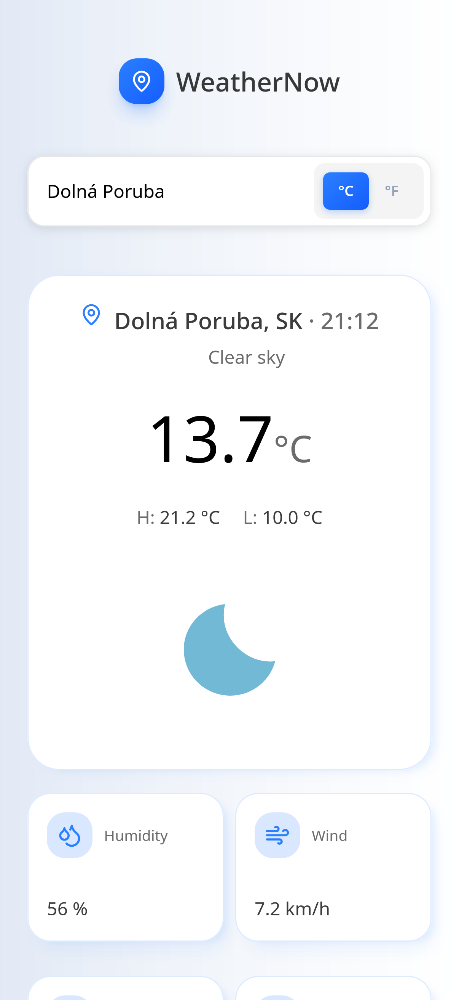
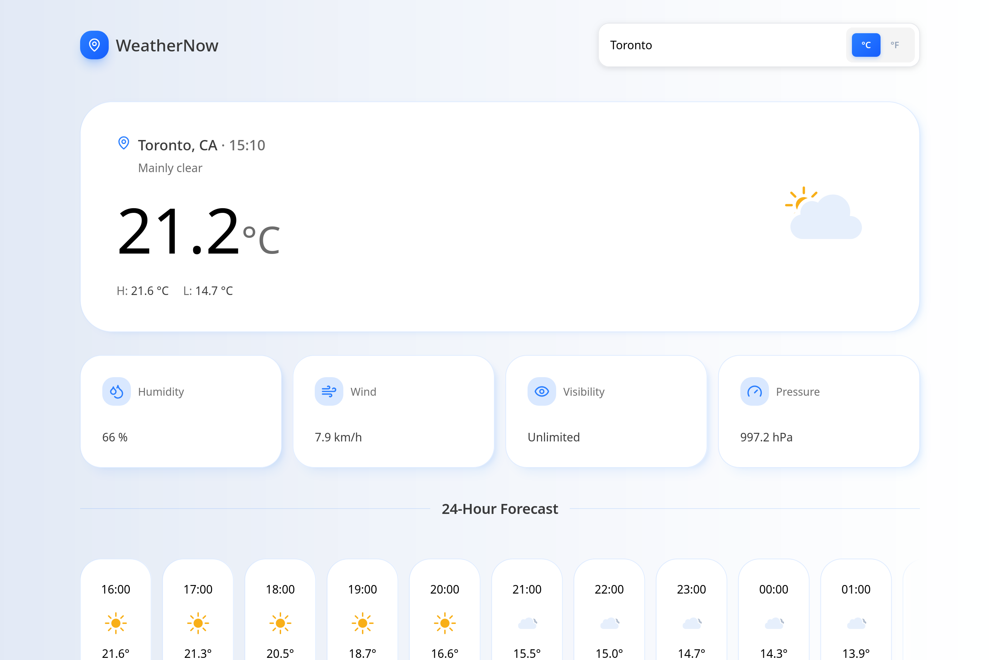

# Weather App

A modern weather application that provides current weather conditions, hourly and daily forecasts, activity-based weather recommendations, and city search suggestions.

## Screenshots

<p align="left">
  
  
</p>

## Tech Stack

* **Frontend:** Vite, React, HeroUI
* **Language:** JavaScript
* **Styling:** CSS, Tailwind CSS
* **Weather API:** OpenMeteo Weather API
* **Geocoding:** Open-Meteo Geocoding API & BigDataCloud Reverse Geocoding API
* **Deployment:** Vercel

## Getting Started

### Prerequisites

Make sure you have the following installed:

* Node.js 18+
* npm
* A Reverse Geocoding API key from [BigDataCloud](https://www.bigdatacloud.com/reverse-geocoding)

### Installation

**Clone the repository:**

```bash
git clone https://github.com/alexkonecny21/weatherApp.git
cd weatherApp
```

**Install dependencies:**

```bash
npm install
```

### Environment Variables

Create a `.env` file in the project root:

```env
VITE_REVERSE_GEOCODING_API_KEY=your_api_key_here
```

### Run the Development Server

```bash
npm run dev
```

Open the application at the local URL shown in your terminal.

### Build for Production

```bash
npm run build
```

**Preview the production build:**

```bash
npm run preview
```

## Responsive Design

The application should work across:

* 📱 Mobile devices
* 💻 Laptops & Tablets
* 🖥️ Desktop screens
